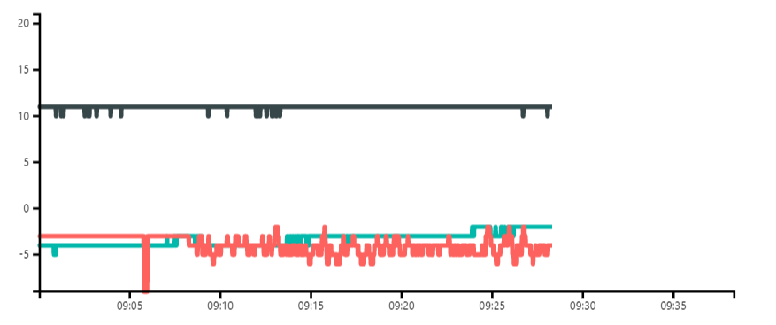

# pbiviz-incrementally-highlighted-multiline-chart

>Disclaimer: This project is just intended for testing. It is not published to the office store (with good reason), and should not be considered as a working plugin in any way.

Incrementally highlighted multiline custom visual for Power BI

This visual is intended to be used along with the [Play Axis](https://github.com/mprozil/PlayAxis) custom visual to step through/animate line series by using the buildt in highlighting capability as a cursor.

Download packaged visual: 
[incrementally-highlighted-multiline-chart.pbiviz](dist/incrementally-highlighted-multiline-chart.pbiviz)